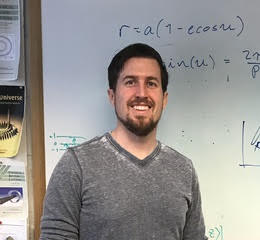

Sam Hadden's Homepage
=====================

.. topic:: About
   :class: center

    I'm a CfA Fellow at the Harvard-Smithsonian Center for Astrophyics.
    I'm interested the formation and dynamical evolution of planetary 
    systems including both our solar system and extrasolar systems.
    
.. topic:: Papers

    View my papers on ADS_

.. topic:: Dynamics Discussion Group

    I organize a `dynamics discussion group`_ at CfA.
    
.. _dynamics discussion group: dynamicsgroup.html
.. _ADS: https://ui.adsabs.harvard.edu/#search/q=orcid%3A0000-0002-1032-0783&sort=date+desc
